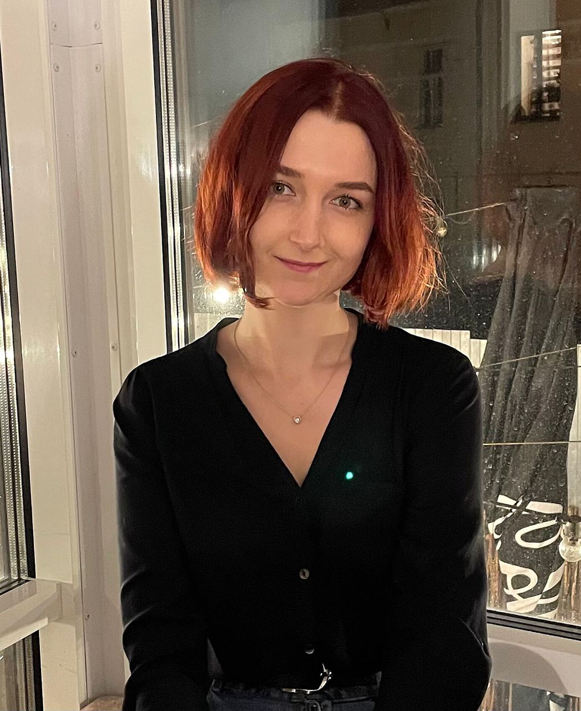

# Tatsiana Malinina's CV



## Contacts

- Phone: **+375 33 3034050**
- Gmail: **molliny42@gmail.com**
- Discord nickname: **Tatsiana Malinina (@molliny42)**
- LinkedIn: **[LinkedIn](https://www.linkedin.com/in/tatsiana-malinina-579163214/)**

## Summary

My goal is to start a career in frontend development and become a professional. With 4 years of experience as a teacher at BSUIR, I have acquired excellent communication skills and teaching experience. Additionally, I have practical knowledge in software testing as a freelance manual tester. My strengths include persistence, responsibility, and a desire to learn and explore new things. I am willing to invest my time and efforts to achieve my goal of becoming a frontend development professional. I believe that the RSSchool JavaScript/Front-end course will equip me with the necessary knowledge and skills to achieve my goal.

## Technical Skills

- JavaScript
- HTML
- CSS
- Git
- Visual Studio Code

## Code examples

### Code example with codewars

```javascript
function howMuchWater(water, load, clothes) {
  if (clothes < load) {
    return "Not enough clothes";
  } else if (clothes > 2 * load) {
    return "Too much clothes";
  } else {
    let extraClothes = clothes - load;
    let extraWater = extraClothes * 0.1;
    let totalWater = water * Math.pow(1.1, extraClothes);
    return parseFloat(totalWater.toFixed(2));
  }
}
```

### Code examples in C#

- [Fitness tracker](https://github.com/molliny42/TMS-DotNet-Malinina/tree/homework_6)
- [Task manager](https://github.com/molliny42/TMS-DotNet-Malinina/tree/homework_3)

## Work experience

### Belarusian State University of Informatics and Radioelectronics

Assistant teacher, 09.2017-09.2021

During my work I gained communication skills with various people. Courses taught: Ergonomics of Mobile Applications, Engineering and Psychological Design, Testing, Software Evaluation, Human Life Safety, Management of Students' Graduation Projects.

## Education

### Belarusian State University of Informatics and Radioelectronics

- Bachelor’s degree, 2013-2017
  - Specialty: Engineering and Psychological Support of Information Technologies.
- Master’s degree, 2017-2019
  - Specialty: Process Safety Management.

## Additional Info

- English - Pre-Intermediate
